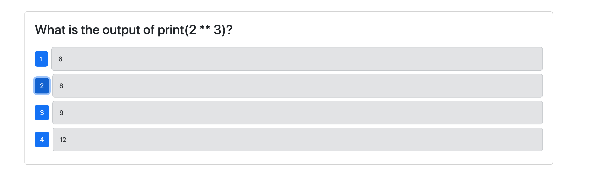

# Python Quiz

## Description

This application was created in order to offer learners of Python a quiz to test their knowledge of Python syntax.  It was created using the MERN stack: Node.js, JavaScript, React as the front-end framework, with MongoDB as the database.  Users are given random mutiple choice questions from a list and their score tallied at the end.  

The application uses GithubActions to run Cypress Tests on the "develop" branch upon a pull request to develop.  Another GithubAction deploys the application to Render when a push is made to the "main" branch. 

## Table of Contents
- [Installation](#installation)
- [Usage](#usage)
- [License](#license)
- [Contributing](#contributing)
- [Tests](#tests)
- [Questions](#questions)

## Installation

After downloading or cloning this repo, make sure you have Node installed and run ``npm run render-build`` to instantiate your application as a Node app.  This will both install all your needed dependencies and set up your TypeScript, and needed Javascript dist folder. Seed the database with ``npm run seed`` and then run the application with ``npm run start``.  

## Usage

Either access the application on Render: https://quiz-75t3.onrender.com

Or run `` npm run start`` and access it on localhost:3001.  

When you start the quiz by clicking "start," you can proceed by answering the questions until you get your score at the end, 10 questions later.  
 

## License

MIT License

The license for this application is MIT License.

https://opensource.org/license/MIT

## Contributing

Contributors: 

Caryn Carter https://github.com/Caryndcarter 

To contribute, contact carter.caryn@gmail.com.

## Tests

Tests for this application have not been written at this time.  When they are written, they will be added in this section.  

## Questions

For questions visit https://github.com/caryndcarter or write to carter.caryn@gmail.com.

